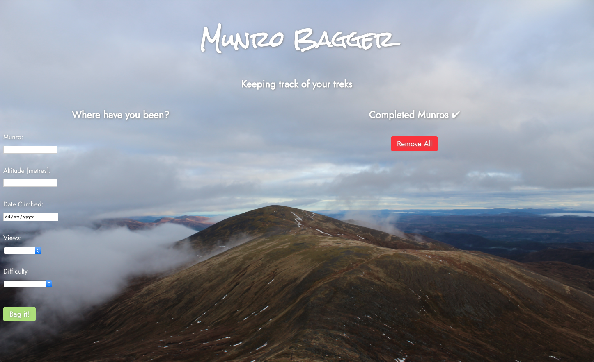
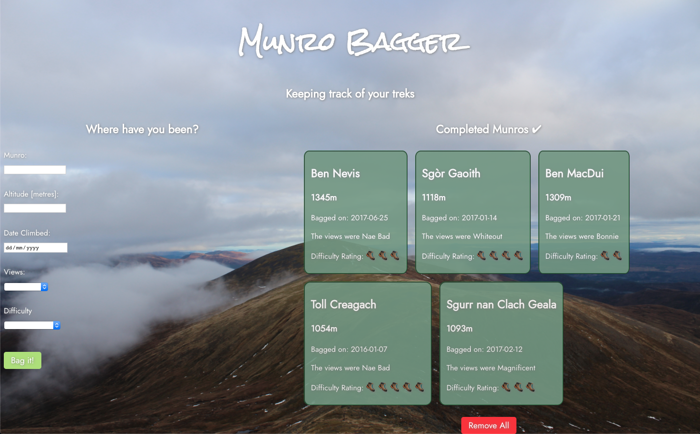

# Munro Bagger App [Basic]

### Brief
Your task is to create a front-end JavaScript application that allows users to input items and see them displayed in a list. 

Users should be able to enter values for different properties relating to the theme and see them displayed below.

### The App

A very basic app that allows the user to input relevant data for creating a list of munros that they have climbed. See below for screenshots of the app with an empty and a populated list:

### Running Instructions

Open the files (I used VScode) and enter open index.html into the terminal and the app should open up in your browser (Chrome is highly recommended). Enjoy!

